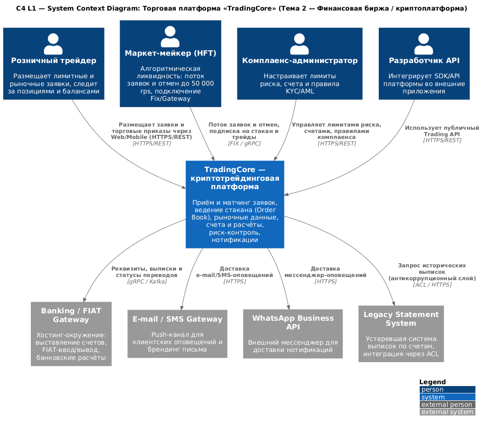
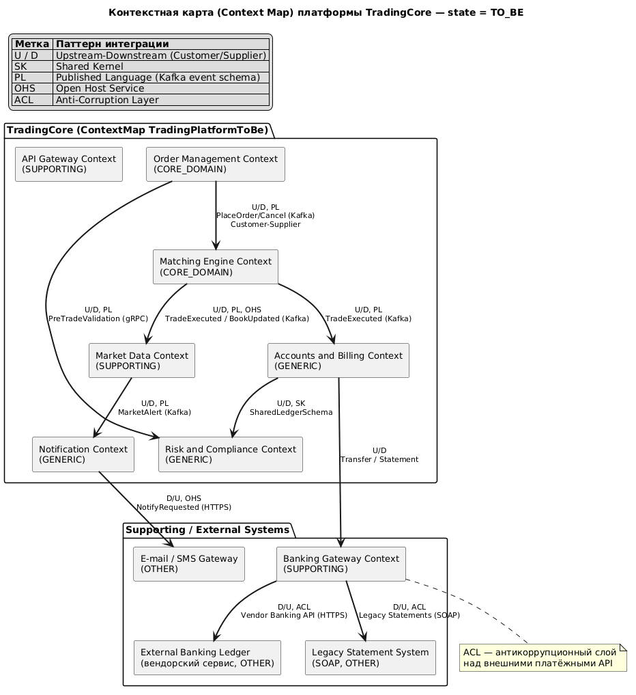
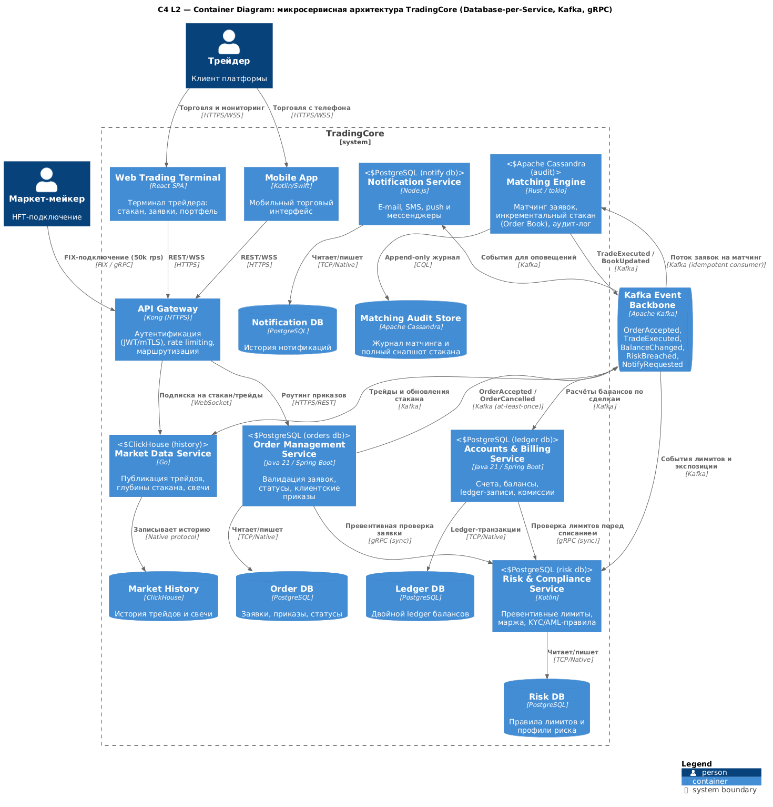

# ЛР1 — Архитектура криптотрейдинговой платформы «TradingCore»

**Автор:** Булатова Элина Эльмаровна
**Группа:** ДИФ11
**Тема:** 2. Финансовая биржа / криптоплатформа

> Оформление дисциплины: Architecture-as-Code. Все диаграммы — исходный код
> (PlantUML, Context Mapper DSL), собранные доказательства рендеров — в `evidence/`,
> решения — в формате MADR (`docs/adr/`).

---

## 1. Описание предметной области

**TradingCore** — криптотрейдинговая платформа, предоставляющая частным трейдерам
и маркет-мейкерам (HFT) доступ к торговле криптовалютными инструментами.

Ключевые функции:

- **Торговля:** размещение лимитных/рыночных заявок, отслеживание статусов приказов;
- **Матчинг + Order Book:** высокочастотный матчинг заявок и ведение стакана
  (критерий: 100 000 op/s, latency p99 < 5 мс);
- **Market Data:** публичный поток трейдов, глубины стакана, свечей;
- **Счета и расчёты:** double-entry ledger балансов, комиссии, крипто/FIAT;
- **Риск-контроль:** превентивные лимиты, маржинальные правила, KYC/AML;
- **Нотификации:** e-mail, SMS, push, мессенджеры.

Критические свойства качества (motivates ASR ниже): экстремальная пропускная
способность стакана, отказоустойчивость (RPO = 0, RTO ≤ 30 с), транзакционная
целостность расчётов.

## 2. Сценарии атрибутов качества (ASR, по SEI ATAM)

### ASR-1. Пропускная способность стакана заявок (производительность)

| Элемент по SEI | Содержание |
|---|---|
| **Source** | Маркет-мейкер (HFT-десктоп, алгоритмическая стратегия) |
| **Stimulus** | Пиковый поток **100 000 операций/с** (placement/cancel заявки) в течение 30 минут |
| **Artifact** | Matching Engine и Order Book (Core Domain, `matching-engine` сервис) |
| **Environment** | Нормальный режим работы, пиковые рыночные часы |
| **Response** | Платформа принимает, валидирует и матчит заявки, публикует обновления стакана и трейды в market-data поток; ни одна корректная заявка не должна быть потеряна |
| **Response Measure** | t(p99) ≤ 5 мс (place→ack); t(p99) ≤ 20 мс (place→матч); пропускная способность ≥ 100 000 op/s; доля потерянных заявок = 0; отсутствие ошибок 5xx |

Достижение: выделенный сервис Matching Engine (Rust, стакан в памяти,
шардирование по инструментам) см. [ADR-002](./docs/adr/ADR-002-service-decomposition.md).

### ASR-2. Отказоустойчивость при потере зоны доступности (надёжность)

| Элемент по SEI | Содержание |
|---|---|
| **Source** | Оператор инфраструктуры / сбой стойки или брокера Kafka |
| **Stimulus** | Внезапная потеря одной зоны доступности (AZ) во время пиковой нагрузки |
| **Artifact** | Платформа TradingCore целиком (кластеры сервисов, Kafka, PostgreSQL) |
| **Environment** | Нормальный режим работы (не режим деградации, не обслуживание) |
| **Response** | Оркестратор детектит отказ, маршрутирует трафик в уцелевшие AZ; Kafka (RF = 3) и PostgreSQL (синхронная репликация) не теряют подтверждённые данные; клиент продолжает торговлю |
| **Response Measure** | RPO = 0 (нулевой data loss); RTO ≤ 30 с; история маркет-мейкера: ≤ 1 отмена заявки в окно 10 мин; счётно-значимые балансы консистентны |

Достижение: bulkhead-изоляция сервисов, Kafka RF = 3, идемпотентные консюмеры,
Transaction Outbox, replicate в 2 AZ см. [ADR-002](./docs/adr/ADR-002-service-decomposition.md).

### ASR-3. Транзакционная целостность расчётов (целостность балансов)

| Элемент по SEI | Содержание |
|---|---|
| **Source** | КлиентShop (трейдер), параллельно торгующий через API и Web |
| **Stimulus** | Одновременные операции: вывод средств + 2 параллельные заявки на весь баланс |
| **Artifact** | Accounts & Billing Service (double-entry ledger), Order Management |
| **Environment** | Нормальный режим, без нагрузки |
| **Response** | Сумма дебета и кредита ledger сбалансирована; double-spend исключён; отзыв заявки и листинг баланса согласованы |
| **Response Measure** | 0 случаев double-spend за 100 000 конкурентных операций; расхождение дебета/кредита = 0; согласованность аудит-лога 100 % |

## 3. Bounded Context Canvas — Core Domain

### Matching Engine Context (`matching-engine`)

| Секция канвы | Содержание |
|---|---|
| **Название / таксономический статус** | Matching Engine — **Core Domain** (источник конкурентного преимущества платформы) |
| **Зона ответственности** | Матчинг заявок по алгоритму price-time priority, ведение инкрементального стакана (Order Book), публикация событий `TradeExecuted`, `BookUpdated`, `MatchingRejected` |
| **Ubiquitous Language** | Order (приказ), Limit/Market Order, OrderBook, PriceLevel, Trade, Fill, PartiallyFilled, Cancelled, Символ (инструмент) |
| **Inbound (вход)** | `orders.accepted` от Order Management (Kafka, at-least-once); конфигурация инструментов; идемпотентность по `orderId` |
| **Outbound (выход)** | `trades.executed`, `book.updated` → Market Data, Accounts (Kafka); gRPC запросы статуса |
| **Бизнес-инварианты** | 1) Стакан отсортирован по цене-времени (best bid/ask) не нарушается; 2) каждая заявка исполняется ровно один раз (idempotency); 3) сумма Fill по заявке ≤ объём заявки; 4) суммарный объём трейдов за интервал равен исполненному объёму заявок |
| **Языки/технологии** | Rust + tokio; stash в памяти; append-only аудит в Cassandra |

**Canonical-структура канвы** (для масштабирования): 8-секционный canvas по
Eric Evans / Vernon: name, strategic classification, domain vision, responsibilities,
ubiquitous language, inbound operations, outbound operations, business invariants.

## 4. Диаграммы (исходники и рендеры)

### 4.1 C4 System Context Diagram (уровень 1)

Система TradingCore представлена «чёрным ящиком» — показаны акторы (трейдер,
маркет-мейкер, комплаенс, разработчик API) и внешние системы (банковский шлюз,
e-mail/SMS, мессенджеры, legacy-система выписок с интеграцией через ACL).

* Исходник: `docs/architecture/c4-system-context.puml`
* Рендер: `evidence/c4-system-context.png`



### 4.2 Context Map (Context Mapper DSL)

Исходная модель СЕ/ContextMapperDSL и её визуализация. Отношения Customer/Supplier,
Published Language (Kafka), Open Host Service (Market Data), Shared Kernel (схема
ledger) и ACL (адаптация внешних платёжных API).

* Исходник CML: `docs/architecture/context-map.cml`
* Визуализация: `docs/architecture/context-map.puml` → `evidence/context-map.png`



### 4.3 C4 Container Diagram (уровень 2)

Микросервисы по bounded context, у каждого сервиса — собственная база данных
(**Database-per-Service**), интеграция через **Apache Kafka** (Publish Language),
синхронные проверки — **gRPC**, клиентские каналы — **HTTPS/REST, WebSocket, FIX**.

* Исходник: `docs/architecture/c4-container.puml` → `evidence/c4-container.png`



## 5. Архитектурные решения (ADR)

| ID | Решение | Статус |
|---|---|---|
| [ADR-001](./docs/adr/ADR-001-architecture-as-code.md) | Architecture-as-Code: исходники диаграмм в Git, решения по MADR | accepted |
| [ADR-002](./docs/adr/ADR-002-service-decomposition.md) | Микросервисы + Database-per-Service + Kafka | accepted |

## 6. Сборка (make build-docs) — Автоматизация

```bash
make build-docs   # рендерит все .puml -> evidence/*.png, *.svg (PlantUML-сервер)
make lint         # валидирует синтаксис PlantUML (реальным рендером) и структуру .cml
```

Локальный вариант для VS Code: расширения **PlantUML** и **Context Mapper**
(VS Code Marketplace), JVM + PlantUML Graphviz не нужен (Smetana layout).

## 7. Структура репозитория

```
.
├── Makefile                     # единая точка сборки: make build-docs
├── README.md                    # этот файл (сдача: ссылка на репозиторий)
├── docs/
│   ├── adr/                     # архитектурные решения (MADR)
│   │   ├── README.md
│   │   ├── ADR-001-architecture-as-code.md
│   │   └── ADR-002-service-decomposition.md
│   └── architecture/
│       ├── c4-system-context.puml
│       ├── c4-container.puml
│       ├── context-map.puml
│       └── context-map.cml          # Context Mapper DSL
├── evidence/                    # PNG/SVG рендеры (доказательства сборки)
└── scripts/
    ├── build-docs.py            # рендер через PlantUML-сервер
    └── lint.sh                  # lint PlantUML + CML
```

## 8. Проверка (self-verification)

* `make lint` — синтаксис всех диаграмм валиден (рендер = проверка);
* все рендеры лежат в `evidence/` и встроены в этот README.
